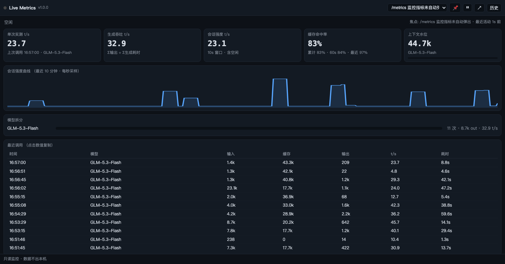

# ZCode Live Metrics · 实时指标监控插件

[](LICENSE)
[](#安装部署)
[](#安装部署)

为 [ZCode](https://z.ai) 提供运行时实时指标监控：**token 处理速度**与**缓存命中率**。
模型调用一完成，200ms 内上屏；生成期间显示诚实的中场状态（已耗时计时 + 上次实测速度）；
多任务窗口切换时焦点自动跟随，可一键钉住。

**只读取证，零侵入**：不拦截、不修改、不注入任何会话内容，数据不出本机。

> English: A ZCode plugin that monitors runtime metrics in real time — token throughput and
> prompt-cache hit rate. Sub-200ms completion-to-screen, honest mid-generation state, focus
> following across task windows, and a cross-session history view. Strictly read-only.

## 界面预览



实时面板（悬浮窗与之同源同款）：指标卡、会话强度曲线、模型拆分、最近调用表，SSE 数据变更即推送。
另有历史视图：按天 / 按会话聚合（复扫 rollout 日志，不自建存储）。

## 功能特性

- **指标口径分明**
  - 单次实测速度：最近一次调用 output ÷ 耗时
  - 生成吞吐：Σoutput ÷ Σ生成耗时（纯生成时间，回答"模型跑多快"）
  - 会话强度：10s/60s 窗口 Σoutput ÷ 墙钟时长（含空闲，回答"会话忙不忙"）
  - 缓存命中率：累计 / 60s / 最近一次三粒度
  - 上下文水位：最近一次输入侧总量，已知模型给百分比
  - 模型维度拆分（主对话 / 子代理会话天然分离）与重试可见（attempt > 1 标记）
- **四种呈现形态**
  - 悬浮指标窗：随会话自动弹出的置顶原生小窗（macOS WKWebView；Linux 降级浏览器 app 模式）
  - 独立面板：浏览器打开 `http://127.0.0.1:7735/`，SSE 实时推送，可暂停/冻结、点击复制
  - 会话内输出：`/metrics` 命令（`summary` / `snapshot` / `dashboard`）
  - MCP 工具：`metrics_snapshot` / `metrics_summary` / `open_dashboard`，agent 可自主查询
- **永不离场**
  - daemon 与会话解耦：监控生命周期 = 最后一个活跃会话的生命周期
  - daemon 被杀 → 下次 hook 事件自动拉活；悬浮窗丢失 → 30s 内自动重开
  - 组件崩溃 30s 内自愈；多实例接管而非互杀
- **零依赖、零侵入**
  - 服务端只用 Node 标准库（Node ≥ 18），无 npm 包、无构建步骤
  - 全程只读本机日志；服务仅监听 `127.0.0.1`；hooks 恒 exit 0、不占模型 token

## 指标口径

| 指标 | 公式 |
|---|---|
| 单次实测速度 | `output_tokens ÷ (durationMs/1000)` |
| 生成吞吐 | `Σoutput ÷ Σduration`（纯生成时间） |
| 会话强度 | 窗口内 `Σoutput ÷ 窗口墙钟秒数`（10s / 60s） |
| 缓存命中率 | `cache_read ÷ (input + cache_read + cache_creation)`，分母为 0 显示 `—` |
| 上下文水位 | 最近一次 `input + cache_read + cache_creation`；内置模型上下文窗表给百分比 |

生成中的调用在宿主日志里不存在 token 数据（已验证），因此速度位在生成期间显示**上次实测值**并明确标注；
这是只读模式下的物理上限，也是产品语义的一部分。

## 工作原理

ZCode 把每次模型调用的完整 I/O 写入本地 rollout 日志（调用完成时落盘），宿主运行日志携带结构化的
会话/请求事件。本插件以**只读尾读**方式消费这两个数据源：

```
rollout jsonl ──120ms 尾读──▶ daemon 聚合引擎 ──变更即推 SSE──▶ 悬浮窗 & 浏览器面板
宿主日志 ────120ms 尾读──▶ 生成中状态 + 焦点信号        │
hooks ──▶ active-session.json ──▶ 焦点会话判定 ────────┤
MCP 薄代理 ──▶ HTTP ◀───────────────────────────────────┘
```

## 安装部署

**要求**：macOS 或 Linux；Node ≥ 18；悬浮窗的 macOS 原生形态需要 Xcode Command Line Tools（缺失时自动降级为浏览器）。

1. ZCode → 设置 → 插件市场 → 添加仓库（本仓库 URL）
2. 安装 **Live Metrics 实时指标监控**
3. 新建会话生效：悬浮窗自动弹出；或浏览器打开 `http://127.0.0.1:7735/`

**本地开发**：使用 `plugins/marketplace.json`（市场名 `dev-zcode-tool`）指向 `plugins/` 目录即可与
GitHub 版并存调试。

**配置**：插件设置中的「自动显示悬浮指标窗」开关对所有启动路径生效（包括 hook 拉起的 daemon）。

## 文档

- 开发者文档：[plugins/live-metrics/README.md](plugins/live-metrics/README.md)

## License

MIT
